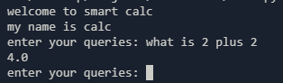

# Smart Calc

a calculator made in python that can somewhat understand normal human language and do very simple calculations. to run it download the source code from the github release and run the `main.py` file and use the cli to communicate.

